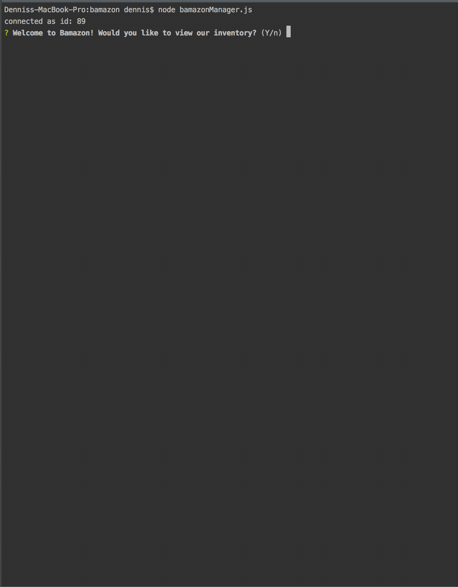
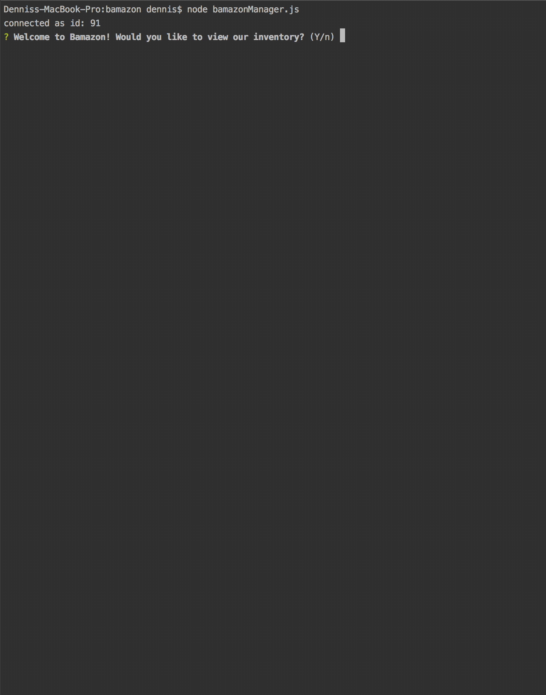

# Bamazon
University of Denver Coding Bootcamp Week 12 - Bamazon Inventory

 ```
Welcome to Bamazon! This is an Amazon-like storefront built with MySQL and Node.js. 

Within the customer portal, use the prompts to view the inventory, choose an item you would like to purchase,
along with the total quantity desired. If the store has adequate inventory you will be able to complete the purchase
and the stock number will be updated accordingly.

However, if we do not have enough of the selected item in stock deeming us unable to fulfill your purchase, the transaction 
will not go through and you will be prompted to lower you desired quantity. 


Happy shopping!
 ```

### First demo demonstrates the ordering process.

### Second demo demonstrates how the IPhone stock quantities are updated from 29 to 25 after the order was placed.
### Also, the demo demostrates what happens if the order cannot be processed due to low inventory.  



### Built With

```
* MySQL
* Node.JS
* JavaScript

```

### Contributing

```
There are different ways to contribute
* Back End
* Designers
* Genius Idea's
* Unit Testers
* etc.
```

### Contributers

```
* Dennis Platts-Dethman
```

